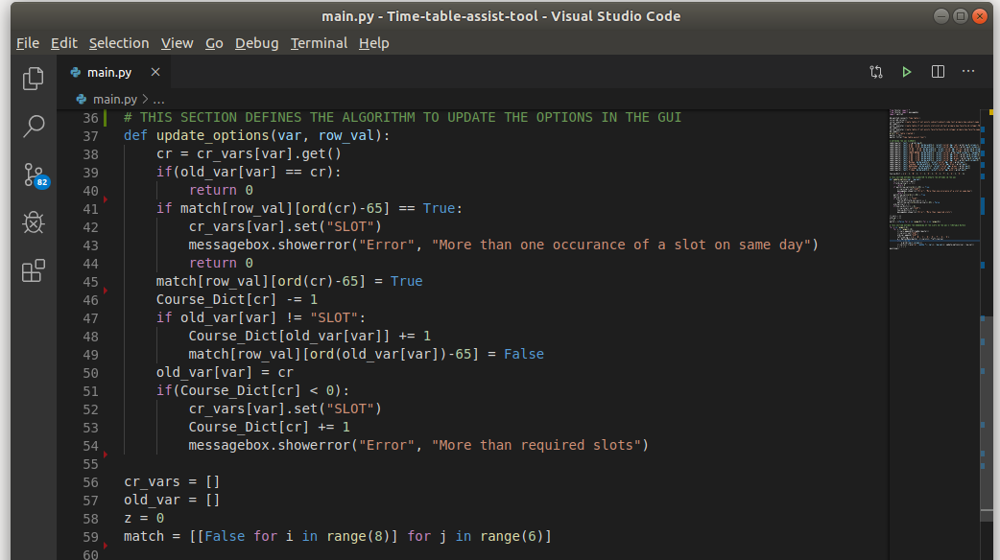
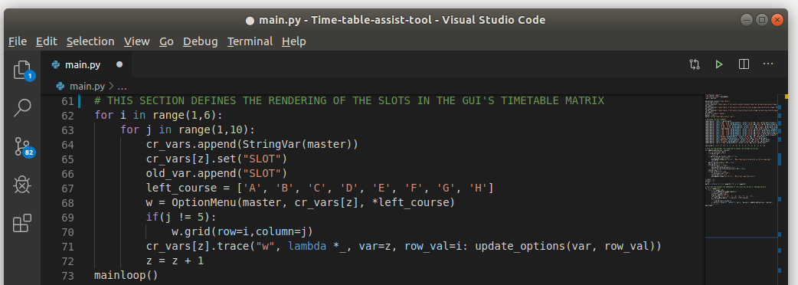

######################
**Developer Manual**
######################

*Software Requirements*
========================

The following softwares are needed to be installed:

* Python3

 * tkinter
 * openepyxl

* Sphinx

.. code-block:: python

    sudo apt-get install python3
    sudo apt-get install python3-tk
    pip install openepyxl

Sphinx installation in needed in case you want to work on the documentation

.. code-block:: python

    pip install sphinx

Note that to compile the changes made to the documentation you have to move to the docs folder and compile your changes

.. code-block:: python 

    cd docs/
    make html

The file will be changes in the *build/html* folder

For more information on working with sphinx you can refer: 
https://www.sphinx-doc.org/en/master/index.html

*Working on the Project*
========================

1. Clone the Repository
2. Working on any of the given modules:

 * GUI#1
 * GUI#2
 * Documentation

Clone the Repository
---------------------

1. Got to the given link
    https://github.com/PS-Ddevil/Time-table-assist-tool

2. Click on the fork option to make a copy of the repo on your profile

.. image:: img/Fork1.png
    :width: 80%
    :align: center

3. Go to a desired location on you local system(PC).
4. Open the terminal by pressing *Alt+Ctrl+T*
5. Run the command

.. code-block:: python

    git clone https://github.com/<git-username>/Time-table-assist-tool.git

Where <git-username> refers to the Username of your Github Profile

Working on GUI#1
-----------------
1. Move to the cloned the folder

    .. code-block:: python

        cd Time-table-assist-tool

2. Open the *prob1.py* file.

    Open the *prob1.py* file in any text editor of your choice

    For Sublime Editor:

    .. code-block:: python
        
        subl prob1.py

    For Atom Editor:

    .. code-block:: python
        
        atom prob1.py

    For Visual Studio Code:

    .. code-block:: python
        
        code prob1.py

3. There are three broad sections in the code 

 * GUI Development 
 * Slot management algorithm section
 * Slot rendering section

SECTION 1:

.. image:: img/dev_GUI1_1.png
    :scale: 60%
    :align: center

SECTION 2:

SECTION 3:

4. Modify the code accordingly and commit changes when necessary.