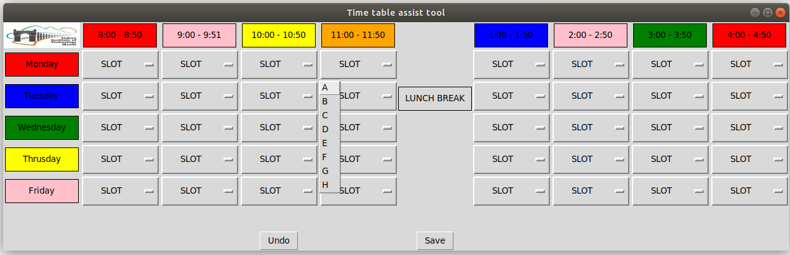
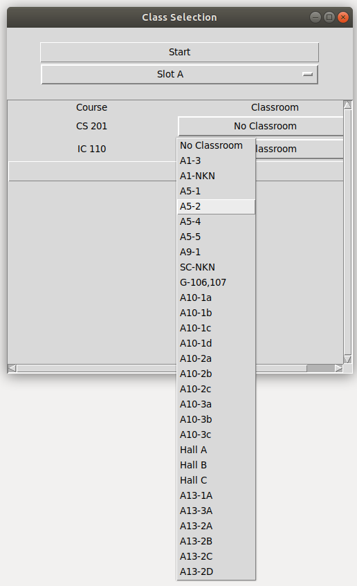

################
**User Manual**
################

**Setting Up the Project**
============================

Software requirement:

**NOTE:**

**Ensure Python3 in installed in your system. In case both version of python in installed then use python3 in place of python. Otherwise, if python3 is default then use python. Also use pip ot pip3 accordingly**

Either install all python dependencies using requirment.txt :-

.. code-block:: python
    
    pip3 install -r requirements.txt

OR, Install the all python dependencies one by one :-

.. code-block:: python
    
    sudo apt-get install python3-tk
    python3 main.py
    pip3 install xlwt
    pip3 install xlsxwriter
    pip3 install xlrd
    pip3 install openpyxl
    pip3 install ezodf
    pip3 install python-docx
    pip3 install tkscrolledframe

Following document are required for a smooth functioning of the applicaion. 

1. Elective docs files (need to be save in *src/data/basket_elective_docs*. Any other location wont be considered.)

2. A file for the courselist i.e all the courses with their respective course code and faculty list being offered in a given semester for the various batches need to be stored (the file has to save in "src/data" in ods format having the name as Courselist.ods, failing to do so will lead to unpredictable malfuntions.)

3. In case of any change in the classroom they need to be saved in the prog3.py file at the location *progs/prog3.py*. To get detailed steps refer to FAQ in the end of the this page.

4. Create a folder in src/tmp with the name baskets.

5. Follow the step of working with Landing GUI to initialise the required state for working of the application.

**Working in Landing GUI**
============================

1. To open the window run the following code in cmd (Windows) or terminal (Linux)

.. code-block:: python

    python main.py

**NOTE: In case you use python3 to use python3 version then run python3 main3.py**

.. image:: img/GUI0_main.png
    :scale: 60%
    :align: center

2. Click on Initialise to make all the required file. Wait till the window shown below appears.

.. image:: img/GUI0_main_1.png
    :scale: 60%
    :align: center

3. The window have all the course which has multiple professor. By default the first professor is assumed as the main professor. To change that you can edit them in src/tmp/baskets/course_faculty_optional.xlsx

**Working in GUI #1**
======================

*Steps*
--------

.. image:: img/GUI1_main.png
    :scale: 60%
    :align: center

1. To open the window run the following code in cmd (Windows) or terminal (Linux)

.. code-block:: python

    python main.py

and then click on the Time Table Button.

**NOTE: In case you use python3 to use python3 version then run python3 main3.py**

2. Select the slots from drop down

* The window opens up as a seperate pop up

.. image:: img/GUI1_main.png
    :scale: 60%
    :align: center

* Mouse over the desired block and click on it to view the slots

*Anamolies Management*
-----------------------

Case 1
^^^^^^^
* Selecting of more than four slots

.. image:: img/GUI1_1_1.png
    :scale: 60%
    :align: center

* Error notice view 

Case 2
^^^^^^^

* Selecting more than one occasions for one slot in a day

.. image:: img/GUI1_2_1.png
    :scale: 60%
    :align: center

* Error notice view

.. image:: img/GUI1_2_2.png
    :scale: 60%
    :align: center

**Working in GUI #2**
======================

*Steps*
--------

1. To open the window run the following code in cmd (Windows) or terminal (Linux)

.. code-block:: python

    python main.py

and then click on the Slot Selection Button.

**NOTE: In case you use python3 to use python3 version then run python3 main3.py**

2. Select the slots from drop down

* The window opens up as a seperate pop up. Click on the Start button

* The application will automatically upload all the concerned 

.. image:: img/GUI2_main_1.png
    :scale: 60%
    :align: center

* Select the basket you want to work upon

.. image:: img/GUI2_main_2.png
    :scale: 60%
    :align: center

* The window will get the informations about the basket including the baskets

.. image:: img/GUI2_main_3.png
    :scale: 60%
    :align: center

* Click on the slot selection dropdown corresponding to the course.

.. image:: img/GUI2_main_4.png
    :scale: 60%
    :align: center

* Select any one of the slots as per the constraint.

.. image:: img/GUI2_main_5.png
    :scale: 60%
    :align: center

*Anamolies Management*
-----------------------

Case 1
^^^^^^^
* Selecting same slots for two courses in the same basket

.. image:: img/GUI2_1_1.png
    :scale: 60%
    :align: center

* Error notice view

.. image:: img/GUI2_1_2.png
    :scale: 60%
    :align: center

Case 2
^^^^^^^

* Selecting same slots for a prof in two basket

.. image:: img/GUI2_2_1.png
    :scale: 60%
    :align: center

* Error notice view

**Working in GUI #3**
======================

*Steps*
--------

.. image:: img/GUI3_main.png
    :scale: 60%
    :align: center

1. To open the window run the following code in cmd (Windows) or terminal (Linux)

.. code-block:: python

    python main.py

and then click on the Class Selection Button.

**NOTE: In case you use python3 to use python3 version then run python3 main3.py**

2. Select the Classrooms

* The window opens up as a seperate pop up. Click on the Start button.

.. image:: img/GUI3_main.png
    :scale: 60%
    :align: center

* The data would be loaded in the background and select Slot button would appear.

.. image:: img/GUI3_main_1.png
    :scale: 60%
    :align: center

* Select one of the slot to work upon by selecting from the dropdown.

.. image:: img/GUI3_main_2.png
    :scale: 60%
    :align: center

* All the courses with that slot assigned will appear.

.. image:: img/GUI3_main_3.png
    :scale: 60%
    :align: center

* Click on the dropdown button wo select any one one of the class

* Selected Classroom will we registered. Save on all the courses being assigned a classroom.

*Anamolies Management*
-----------------------

Case 1
^^^^^^^
* Selecting same slots for two courses in the same basket

* Error notice view

**FAQs**
=========

**1. How to include new classroom into the application?**

Follow the following steps to include new classrooms into the application:

1. Open the file prog3.py from the location *progs/prog3.py*. 

2. Find a list of classes defined by the variable "classes".

3. Modify the classlist with the new entries while removing the ones not required(if any).

4. Save the changes.

**2. What is the flow of work in the application?**

Any client is expected to follow the following workflow while operatiing this application.

1. After following the steps defined in the Getting Started section, Move to the main GUI.

2. Folow the steps in main GUI opeations.

3. Operation in the applicaion should be done in the way that all the courses should be allocated slots, before the classrom are given.  

**3. How to add a new basket after initialisation is already done?**

Follow the following steps to make a new basket.

1. Go to src/tmp/baskets/ and create a new excel sheet.

2. Open any already created basket and use the same convention to make the new basket.

3. Rename the new excel sheet as the basket name. 

 * In case of elective name it as the minor it belong (Suggestion). The name should be unique.

 * In case of core course list, use the semester and branch to uniquely identify it.