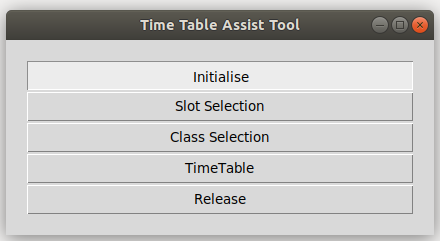
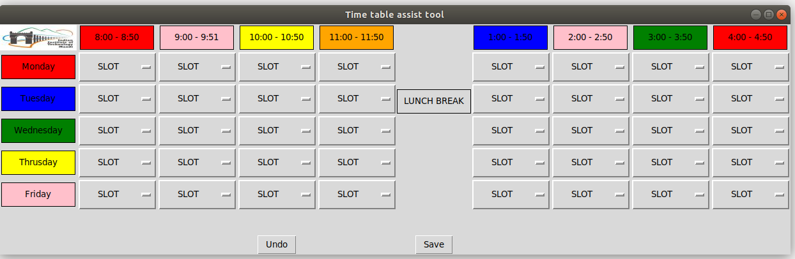
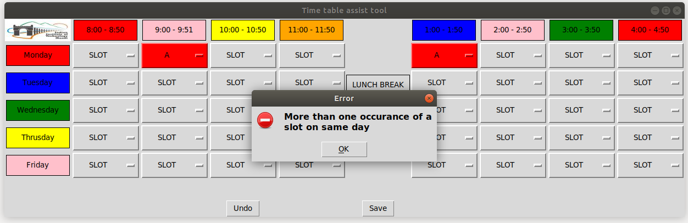
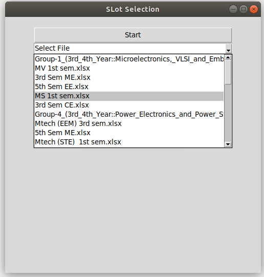
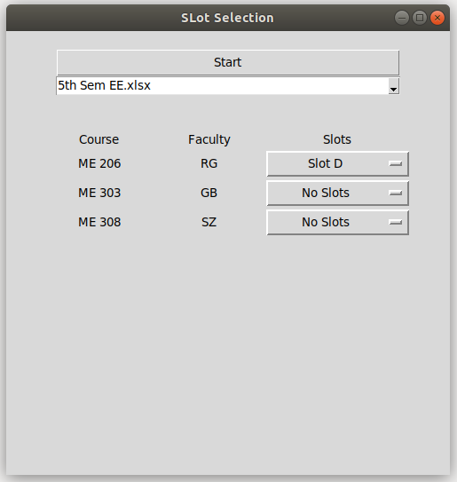

################
**User Manual**
################

**Working in GUI #1**
======================

.. image:: img/GUI0_main.png
    :scale: 60%
    :align: center

Click on Initialise to make all the required file.

**Working in GUI #1**
======================

*Steps*
--------

1. To open the window explicitly type the following code in cmd (Windows) or terminal (Linux)

.. code-block:: python

    python prog1.py

2. Select the slots from drop down

* The window opens up as a seperate pop up

* Mouse over the desired block and click on it to view the slots

.. image:: img/GUI1_main_1.png
    :scale: 60%
    :align: center

*Anamolies Management*
-----------------------

Case 1
^^^^^^^
* Selecting of more than four slots

.. image:: img/GUI1_1_1.png
    :scale: 60%
    :align: center

* Error notice view 

.. image:: img/GUI1_1_2.png
    :scale: 60%
    :align: center

Case 2
^^^^^^^

* Selecting more than one occasions for one slot in a day

.. image:: img/GUI1_2_1.png
    :scale: 60%
    :align: center

* Error notice view

**Working in GUI #2**
======================

*Steps*
--------

.. image:: img/GUI2_main.png
    :scale: 60%
    :align: center

1. To open the window explicitly type the following code in cmd (Windows) or terminal (Linux)

.. code-block:: python

    python prog2.py

2. Select the slots from drop down

* The window opens up as a seperate pop up. Click on the Start button

.. image:: img/GUI2_main.png
    :scale: 60%
    :align: center

* The application will automatically upload all the concerned 

* Select the basket you want to work upon

* The window will get the informations about the basket including the baskets

.. image:: img/GUI2_main_3.png
    :scale: 60%
    :align: center

* Click on the slot selection dropdown corresponding to the course.

.. image:: img/GUI2_main_4.png
    :scale: 60%
    :align: center

* Select any one of the slots as per the constraint.

*Anamolies Management*
-----------------------

Case 1
^^^^^^^
* Selecting same slots for two courses in the same basket

.. image:: img/GUI2_1_1.png
    :scale: 60%
    :align: center

* Error notice view

.. image:: img/GUI2_1_2.png
    :scale: 60%
    :align: center

Case 2
^^^^^^^

* Selecting same slots for a prof in two basket

* Error notice view

.. image:: img/GUI2_2_2.png
    :scale: 60%
    :align: center

**Working in GUI #3**
======================

*Steps*
--------

.. image:: img/GUI3_main.png
    :scale: 60%
    :align: center

1. To open the window explicitly type the following code in cmd (Windows) or terminal (Linux)

.. code-block:: python

    python prog2.py

2. Select the Classrooms

* The window opens up as a seperate pop up. Click on the Start button.

.. image:: img/GUI3_main.png
    :scale: 60%
    :align: center

* The data would be loaded in the background and select Slot button would appear.

.. image:: img/GUI3_main_1.png
    :scale: 60%
    :align: center

* Select one of the slot to work upon by selecting from the dropdown.

.. image:: img/GUI3_main_2.png
    :scale: 60%
    :align: center

* All the courses with that slot assigned will appear.

* Click on the dropdown button wo select any one one of the class

.. image:: img/GUI3_main_4.png
    :scale: 60%
    :align: center

* Selected Classroom will we registered. Save on all the courses being assigned a classroom.

.. image:: img/GUI3_main_5.png
    :scale: 60%
    :align: center

*Anamolies Management*
-----------------------

Case 1
^^^^^^^
* Selecting same slots for two courses in the same basket

.. image:: img/GUI3_1_1.png
    :scale: 60%
    :align: center

* Error notice view

.. image:: img/GUI3_1_2.png
    :scale: 60%
    :align: center